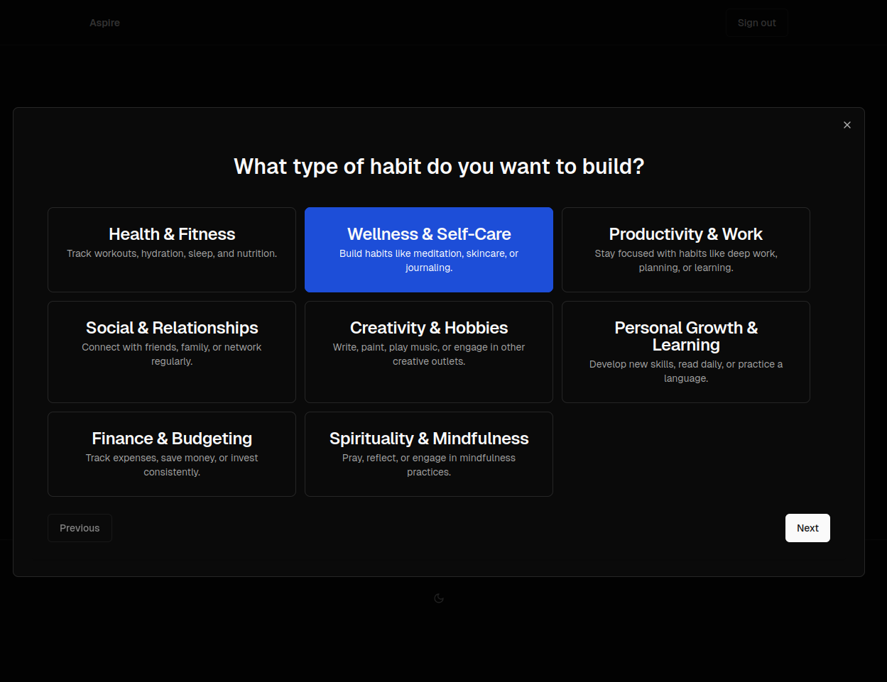
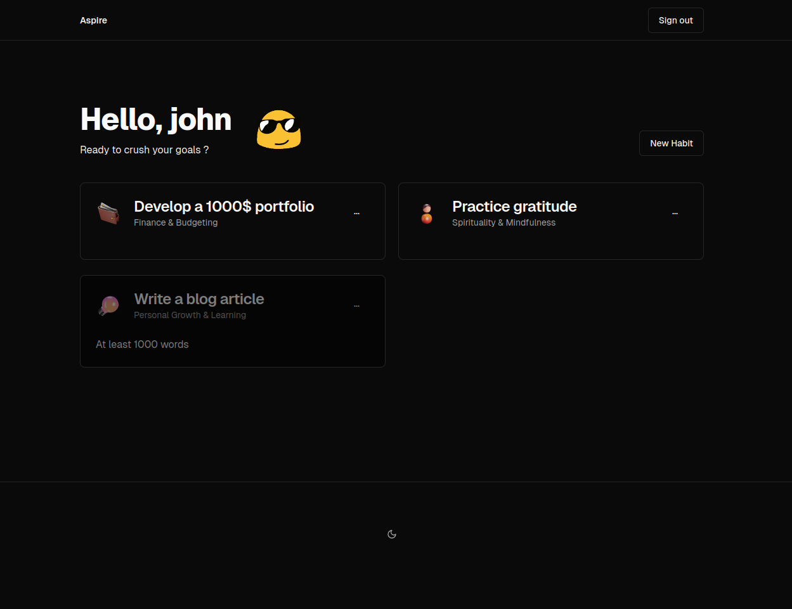

# **Aspire : Suivez vos Habitudes, Atteignez vos Objectifs !**

Bienvenue sur **Aspire**, l'application ultime pour suivre vos habitudes, se fixer des objectifs et **aspirer** à un meilleur futur  !

## **Pourquoi Aspire ?**

- **Suivi Personnalisé :** 📊 Créez et suivez vos habitudes quotidiennes.
- **Objectifs Clairs :** 🎯 Définissez des objectifs précis et mesurez vos progrès en temps réel.
- **Aspect Social :** 🗣️ Partagez vos succès et défis avec des amis ou rejoignez des groupes pour rester motivé.
- **Interface Intuitive :** 📱 Une expérience utilisateur fluide et agréable pour une utilisation quotidienne.

## **Fonctionnalités Actuelles**

- **Création et Suivi d'Habitudes :** 📅 Ajoutez des habitudes et suivez vos progrès avec des rappels personnalisés.
- **Chats et Groupes :** 💬 Discutez et partager vos idées sur un chat général.

## **Rendu de l'application**

## **Roadmap**

### **Fonctionnalités Réalisées**

- [x] Création et suivi d'habitudes.
- [x] Fixation d'objectifs personnels.
- [x] Fonctionnalité de chat pour interagir avec des amis.

### **En Cours de Développement**

- [ ] Intégration de défis communautaires pour encourager la participation.
- [ ] Amélioration des notifications pour une meilleure rétention utilisateur.

### **À Venir**

- [ ] Système de badges et de récompense.
- [ ] Recherche et filtres avancés.
- [ ] Personnalisation avancée des profils utilisateurs.
